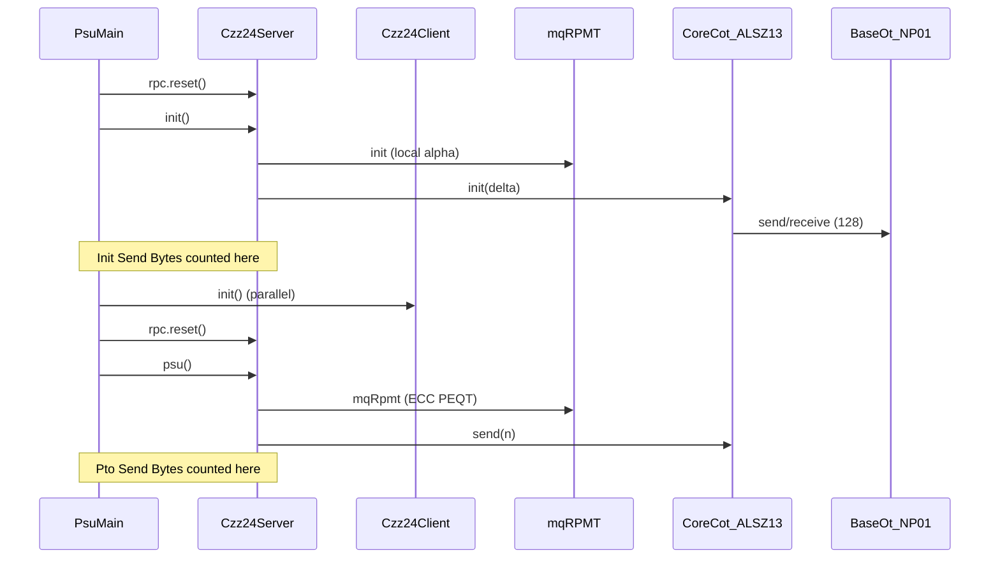

# Protocol implementations and fair-benchmark cost accounting

This document describes **every runnable PSU / PSI / UPSU protocol** in the `mpc4j-psu` reactor: where the code lives, how each phase is implemented, which cryptographic primitives are used, and **exactly what the fair benchmark (`PsuMain`, `PsiMain`, `UpsuMain`) counts** in Init vs Pto time and bytes.

Related artifacts:

- [README.md](README.md) — docs index
- [protocols/README.md](protocols/README.md) — **one doc per protocol** (bench display names)
- [OT_BASE_COST_AUDIT.md](OT_BASE_COST_AUDIT.md) — audit conclusions and status table
- [PROTOCOL_MAPPING.md](PROTOCOL_MAPPING.md) — display name ↔ enum ↔ module path
- [Ours_IMPLEMENTATION.md](Ours_IMPLEMENTATION.md) — **Ours** / small-set **leakage baseline** (deep dive)

**Display names** in tables below (e.g. `PKC:CheZhaZha24`) match fair-bench CSV summaries; internal enum IDs are in backticks. Mapping: `scripts/libpsu/protocol_display_names.py`.

---

## 0. Module path convention

| Role | Current path in this repo | Legacy name (docs / Maven) |
|------|---------------------------|----------------------------|
| Protocol code | `mpc4j-psu/protocols/<category>/<name>/` | `mpc4j-psu-protocol-<name>` (artifact ID unchanged) |
| Driver / mains | `mpc4j-psu/apps/driver/` | `mpc4j-psu-driver` |
| Config utils | `mpc4j-psu/libpsu-factory/` | was under `mpc4j-psu-driver` |
| Tests | `mpc4j-psu/tests/` | `mpc4j-psu-tests` |
| Factory dispatch | `mpc4j-psu/mpc4j-psu-balanced/` | `PsuFactory`, `PsiFactory`, … |

**Target libPSU Stage-2:** protocols already live under `protocols/...`; further moves are documented in root [docs/ARCHITECTURE.md](../../docs/ARCHITECTURE.md). Do **not** document a protocol as under `protocols/...` unless it physically exists there.

---

## 1. Fair benchmark: what is measured

### 1.1 Driver entry points

| Driver | Class | Output prefix | Config key |
|--------|-------|---------------|------------|
| Balanced PSU | `edu.alibaba.mpc4j.s2pc.pso.main.psu.PsuMain` | `PSU_<pto>_...` | `psu_pto_name` |
| PSI | `edu.alibaba.mpc4j.s2pc.pso.main.psi.PsiMain` | `PSI_<pto>_...` | `psi_pto_name` |
| Unbalanced UPSU | `edu.alibaba.mpc4j.s2pc.upso.main.upsu.UpsuMain` | `UPSU_<pto>_...` | `upsu_pto_name` / `psu_pto_name` |

Fair scripts (`scripts/run_psu_fair.sh`, etc.) invoke these mains. **Warmup** runs one untimed `init` + `psu`/`psi`/`upsu`, then `rpc.reset()`. The **timed** run follows the pattern below.

### 1.2 Per-run accounting (PsuMain server example)

After `rpc.synchronize()` and `rpc.reset()`:

| Metric | Measured window | Source |
|--------|-----------------|--------|
| **Init Time (ms)** | Wall clock around `protocol.init(maxServer, maxClient)` | `StopWatch` in main |
| **Init DataPacket Num** | Packets sent during init | `rpc.getSendDataPacketNum()` after init |
| **Init Payload Bytes (B)** | Application payload during init | `rpc.getPayloadByteLength()` after init |
| **Init Send Bytes (B)** | Total bytes sent (incl. headers) during init | `rpc.getSendByteLength()` after init |
| *(reset RPC counters)* | | `rpc.reset()` |
| **Pto Time (ms)** | Wall clock around `protocol.psu(...)` / `psi` / `upsu` | `StopWatch` |
| **Pto Send Bytes (B)** | Same counters, post-online phase | `rpc.getSendByteLength()` after pto |

**Critical rule:** All sub-protocols registered with `addSubPto(...)` share the **same** `Rpc` instance as the root PSU/PSI/UPSU object. Any `rpc.send(...)` during `init()` — including Base OT inside `CoreCotSender.init()` — increments **Init Send Bytes**. Anything during `psu()` increments **Pto Send Bytes**.

**Not included in Init/Pto columns (unless noted):**

- Traffic before `rpc.reset()` (warmup).
- **`OoPsuMain` only:** a separate **Pre Time / Pre Send Bytes** phase for `preCompute()` (ROSN / PKC:GMRSS21 mqRPMT offline permutation). Standard fair PSU benches use **`PsuMain`**, which does **not** call `preCompute()`.
- Process startup, file I/O, `System.gc()`, JVM compilation (except as absorbed in first warmup).

### 1.3 Base OT and Core COT (default stack)

For semi-honest PSU/UPSU, the usual stack is:

```
PsuConfig → CoreCotConfig (default: Alsz13CoreCotConfig)
         → BaseOtConfig (default: Np01ByteBaseOtConfig)
```

**Base OT wire protocol** (`Np01ByteBaseOtSender.send` / `BaseOtReceiver.receive`) runs **inside** `Alsz13CoreCotSender.init` / `Alsz13CoreCotReceiver.init`, not as a separate top-level call from PSU code. Therefore:

- **Base OT bytes → Init Send Bytes** (CZZ24 reference pattern).
- **ALSZ13 matrix extension** (`CoreCotSender.send(n)` / `CoreCotReceiver.receive(choices)`) → **Pto Send Bytes**.

Other Core COT types (IKNP03 in JSZ22 CM20 OPRF, Roy22 SoftSpoken in some ASIACCS:CSSW25 configs, Kos15 for malicious defaults) follow the same *init = setup, send/receive = online* split, each with their own Base OT provider.

### 1.4 What we took into cost calculation (audit scope)

The [OT base OT audit](OT_BASE_COST_AUDIT.md) verified:

1. Every OT/COT-using protocol calls sub-protocol `init(...)` from its own `init(...)`.
2. No Base OT is generated before benchmark `rpc.reset()` in the timed run.
3. No mock/dummy OT outputs in fair configs.
4. `preCompute()` is optional and **not** invoked by `PsuMain` (only `OoPsuMain`).

**Result:** No protocol required a fix; all runnable OT/COT paths **include** Base OT in Init totals by default.

**Caveat — multiple Base OT instances in one init:** Protocols that initialize **several** independent Core COT / KKRT OPRF stacks (PKC:GMRSS21, AC:KRTW19, JSZ22 SFC) run Base OT **more than once** in the same Init window. The benchmark **sums** all of them into Init Send Bytes (fair for “what this binary does,” not for “minimal single OT setup”).

### 1.5 Optional debug logs (not in CSV)

| Mechanism | Purpose |
|-----------|---------|
| `OtBenchmarkMetrics` (`mpc4j-psu-common`) | `OT_BASE_DEBUG` lines: init/pto ms and send-byte deltas |
| CZZ24 / PKC:GMRSS21 server | Split mqRPMT init vs `coreCot.init` |
| ASIACCS:CSSW25 | `setupOprfBytes`, `setupCcpsiBytes`, `setupShtrBytes`, `setupOtBytes` |
| EUROCRYPT:PisTri26 | `EUROCRYPT:PisTri26-BW[...]` buckets: setupOprf, ot12, ot3, peel |

These do **not** add columns to `.output` files; they appear in logs when INFO is enabled.

---

## 2. Protocol inventory (runnable)

### Balanced PSU (`PsuType`)

| Display name | Enum | Runnable | Module path |
|--------------|------|----------|-------------|
| AC:AC:KRTW19 | AC:KRTW19 | yes | `protocols/balanced/krtw19` |
| PKC:GMRSS21 | PKC:GMRSS21 | yes | `protocols/balanced/gmr21` |
| USENIX:JSZDG22 | USENIX:JSZDG22 | yes | `protocols/balanced/jsz22` |
| USENIX:JSZDG22_SFS | USENIX:JSZDG22_SFS | yes | `protocols/balanced/jsz22` |
| USENIX:ConYuWeiminDon23_PKE | USENIX:ConYuWeiminDon23_PKE | yes | `protocols/balanced/zcl23` |
| USENIX:ConYuWeiminDon23_SKE | USENIX:ConYuWeiminDon23_SKE | yes — **PsuMain uses 2-party**; optional 3-party+aider API | `protocols/balanced/zcl23` |
| PKC:CheZhaZha24 | PKC:CheZhaZha24 | yes | `protocols/balanced/czz24-cw-oprf` |
| ASIACCS:CSSW25 | ASIACCS:CSSW25 | yes — experimental runnable proxy | `protocols/balanced/css25` |
| USENIX:BinYujConYanYu25 | USENIX:BinYujConYanYu25 | yes | `protocols/balanced/tbz25` |
| USENIX:HaoWan26 | USENIX:HaoWan26 | yes | `protocols/balanced/haowan2026` |
| EUROCRYPT:PisTri26 | EUROCRYPT:PisTri26 | yes | `protocols/balanced/pt26` |
| ACISP:DavCid17 | ACISP:DavCid17 | yes | `protocols/balanced/dc17` |
| ACNS:Frikken07 | ACNS:Frikken07 | yes | `protocols/balanced/f07` |
| Ours | Ours | yes | `protocols/balanced/small-ec-elligator-psu` |
| USENIX:YanShiHonDaw24 | USENIX:YanShiHonDaw24 | yes | `protocols/malicious/jszg24-becrg-psu` |
| EUROCRYPT:PuGaoTri26 | EUROCRYPT:PuGaoTri26 | yes (`PsuTwoSided*`) | `protocols/malicious/pgt26` |

### PSI (`PsiType`)

| Display name | Enum | Module |
|--------------|------|--------|
| C:KisSon05 | C:KisSon05 | `protocols/psi/ks05` |
| JOC:HazNis12 | JOC:HazNis12 | `protocols/psi/hn12` |

### UPSU (`UpsuType`)

| Display name | Enum | Module |
|--------------|------|--------|
| CCS:TCLZ23 | CCS:TCLZ23 | `protocols/unbalanced/tcl23` |
| USENIX:BinYujConYanYu25 | USENIX:BinYujConYanYu25 | `protocols/unbalanced/tbz25` (`mpc4j-psu-protocol-tbz25-upsu`) |

---

## 3. Per-protocol implementation and cost

Each subsection lists: **goal**, **code**, **init**, **online**, **OT/COT**, **benchmark cost**.

---

### 3.1 PKC:CheZhaZha24 (`PKC:CheZhaZha24`, reference for OT accounting)

**Paper / family:** CZZ24 cwOPRF + mqRPMT-style PEQT; semi-honest; **one-sided** (client outputs union).

**Classes:** `Czz24CwOprfPsuConfig`, `Czz24CwOprfPsuServer`, `Czz24CwOprfPsuClient`  
**Sub-PTOs:** `Czz24CwOprfMqRpmtServer/Client`, `CoreCotSender` / `CoreCotReceiver`

#### Init (server)

1. `czz24CwOprfMqRpmtServer.init` — sample local scalar α (no OT).
2. `coreCotSender.init(delta)` — **ALSZ13 + NP01_BYTE Base OT** (128 seed OTs + Base OT messages).

#### Init (client)

1. `czz24CwOprfMqRpmtClient.init` — sample β.
2. `coreCotReceiver.init()` — Base OT + receiver side of seed OTs.

#### Online `psu()` (server)

1. **mqRPMT:** ECC `hashToCurve`, blinded points, PEQT tags, set/Bloom filter → `serverVector[]` (per-server-slot payloads).
2. **Core COT:** `coreCotSender.send(|vector|)` — ALSZ13 extension matrix.
3. **Union delivery:** PRG XOR `r0[i]` with `serverVector[i]`; send `SERVER_SEND_ENC_ELEMENTS`.

#### Online `psu()` (client)

1. **mqRPMT** → `choices[]` (intersection flags per server slot).
2. `coreCotReceiver.receive(choices)`.
3. Decrypt ciphertexts where `choices[i]==false`; union with local set.

#### Cost inclusion

| Component | Phase | In fair bench? |
|-----------|-------|----------------|
| mqRPMT init (local α/β) | Init | Init Time (minimal bytes) |
| **Base OT + COT seed (ALSZ13 init)** | Init | **Init Send Bytes** |
| mqRPMT ECC + PEQT RPC | Pto | Pto Send Bytes |
| COT extension `send/receive(n)` | Pto | Pto Send Bytes |
| Encrypted element payload | Pto | Pto Send Bytes |

**Status:** `INCLUDED_INIT` for Base OT — **canonical reference**.

---

### 3.2 PKC:GMRSS21 (`PKC:GMRSS21`)

**Family:** PKC:GMRSS21 mqRPMT (cuckoo + OKVS + DOSN/ROSN + KKRT OPRF ×2) + Core COT union (same shape as CZZ24 delivery).

**Classes:** `Gmr21PsuConfig`, `Gmr21PsuServer`, `Gmr21PsuClient` (`AbstractOoPsuServer` — supports `preCompute`, unused by `PsuMain`)

**Sub-PTOs:** `Gmr21MqRpmtServer/Client` (nested: cuckoo OPRF, PEQT OPRF, DOSN, ROSN), `CoreCotSender` / `CoreCotReceiver`

#### Init (server)

1. `gmr21MqRpmtServer.init` → inside: `cuckooHashOprfReceiver.init`, `dosnReceiver.init`, `rosnReceiver.init`, `peqtOprfSender.init` — **each KKRT OPRF runs its own `CoreCotReceiver.init()` → extra Base OT**.
2. Send OKVS hash keys (RPC).
3. `coreCotSender.init(delta)` — **second** ALSZ13 Base OT stack for union.

#### Online

1. mqRPMT → `serverVector`.
2. `coreCotSender.send` + XOR encryption (same as CZZ24).

#### Cost inclusion

| Component | Phase |
|-----------|-------|
| KKRT OPRF Base OT (×2) + union Core COT Base OT | **Init** (possibly 3× Base OT) |
| mqRPMT + union COT online | **Pto** |
| `preCompute()` (ROSN permutation) | **Not in PsuMain**; in OoPsuMain **Pre** columns only |

**Status:** `INCLUDED_INIT` (may over-count vs single-OT design).

---

### 3.3 USENIX:JSZDG22

**Family:** JSZ22 “shuffle” PSU — DOSN, ROSN, CM20 multi-point OPRF (IKNP Core COT inside OPRF), **plus** standalone `CoreCotSender` for payload encryption.

**Classes:** `Jsz22SfcPsuConfig`, `Jsz22SfcPsuServer`, `Jsz22SfcPsuClient`

#### Init

1. `dosnReceiver.init`, `rosnReceiver.init`.
2. `oprfSender.init(maxBinNum, maxPrfNum)` — **CM20 → `coreCotReceiver.init()` (IKNP + Base OT)**.
3. `coreCotSender.init(delta)` — **second** Core COT init (ALSZ13 default on standalone field).

#### Online

Multi-step: permutation/OSN, OPRF evaluation, PEQT, `coreCotSender.send(serverElementSize)` for encrypted payloads.

#### Cost inclusion

| Component | Phase |
|-----------|-------|
| OPRF Core COT init + union Core COT init | **Init** (duplicate OT setup) |
| ROSN/DOSN/OPRF/COT online | **Pto** |
| `preCompute(rosn)` | **Not in PsuMain** |

**Status:** `INCLUDED_INIT`.

---

### 3.4 USENIX:JSZDG22_SFS

**Family:** JSZ22 variant with **two** DOSN/ROSN chains and OPRF receiver only (no standalone union `CoreCotSender` on server).

#### Init

`firstDosnSender.init`, `secondDosnReceiver.init`, `firstRosnSender.init`, `secondRosnReceiver.init`, `oprfReceiver.init(maxBinNum)` — OT only via **CM20/IKNP inside OPRF**.

#### Cost inclusion

Base OT in **Init** (via OPRF init only); union COT absent on this variant.

**Status:** `INCLUDED_INIT`.

---

### 3.5 AC:KRTW19

**Family:** Classic RPMT — simple hash bins, polynomial PEQT, pipelined bin columns; KKRT OPRF for RPMT and PEQT; ALSZ13 for encryption.

**Classes:** `Krtw19PsuConfig`, `Krtw19PsuServer`, `Krtw19PsuClient`

#### Init

1. `rpmtOprfReceiver.init(MAX_BIN_NUM)` — KKRT → Base OT.
2. `peqtOprfSender.init(MAX_BIN_NUM)` — KKRT → Base OT.
3. `coreCotSender.init(delta)` — ALSZ13 Base OT.
4. Server sends hash-bin key (RPC).

#### Online

For each bin column: OPRF, PEQT, `coreCotSender.send(binNum)` per column batch.

#### Cost inclusion

Up to **three** Base OT setups in **Init**; all online OPRF/COT/PEQT in **Pto**.

**Status:** `INCLUDED_INIT`.

---

### 3.6 USENIX:ConYuWeiminDon23_PKE

**Family:** ZCL23 PKE mqRPMT (similar high-level shape to CZZ24) + Core COT union.

**Classes:** `Zcl23PkePsuConfig`, `Zcl23PkeMqRpmtServer/Client`, `Zcl23PkePsuServer/Client`

#### Init

`zcl23PkeMqRpmtServer.init` (local) + `coreCotSender.init(delta)`.

#### Online

mqRPMT → vector; `coreCotSender.send`; XOR ciphertexts.

**Cost:** Same as CZZ24 — Base OT in **Init**, extension in **Pto**.

**Status:** `INCLUDED_INIT`.

---

### 3.7 USENIX:ConYuWeiminDon23_SKE

**Family:** ZCL23 SKE — Z2 circuits (`Z2cSender`), OPRP, GF2K-DOKVS, Core COT.

**Classes:** `Zcl23SkePsuConfig`, `Zcl23SkePsuServer/Client`

**Party model:** `USENIX:ConYuWeiminDon23_SKE` has a **pure two-party runnable mode** in `PsuMain` (`PsuFactory.createServer(serverRpc, clientParty, config)` — no aider). Optional **three-party** constructors (`createServer(..., aiderParty, ...)`) use an aider for `Z2cFactory.createSender(..., aiderParty, ...)`. Fair benchmarks use **two-party only**; label aided runs separately if you benchmark the 3-party overload. Fair scripts may warn about LowMC classpath failures (NPE).

#### Init (server)

1. `z2cSender.init(expectNum)` — circuit preprocessing (OT via Bea91 Z2c inside Z2 init).
2. `oprpReceiver.init(maxServerElementSize)`.
3. `coreCotSender.init(delta)` — ALSZ13 Base OT.
4. Send DOKVS hash keys.

#### Cost inclusion

Circuit/OPRP init + **Core COT Base OT** in **Init**; PEQT shares and COT online in **Pto**.

**Status:** `INCLUDED_INIT` (2-party `PsuMain`).

---

### 3.8 ASIACCS:CSSW25

**Family:** Chandran et al. 2025 — **MP-OPRF + CCPSI + ROSN + Core COT** (not AHE-centric). **PrimitiveKind:** MP-OPRF / circuit PSI / COT (`HYBRID` in metadata).

**Classes:** `Css25PsuConfig`, `Css25PsuServer`, `Css25PsuClient`

**Config:** `Css25PsuConfig.Builder(silent)` — default runnable stack is PSTY19 CCPSI
with ASIACCS:CSSW25 1.4x Cuckoo packing, LLL24 flat ROSN, and Roy22/Core-COT wiring. Explicit
`css25_paper_comparison=true` / `setPaperComparisonProxy()` opts into the slower RS21
comparison proxy. Explicit `css25_paper_exact=true` / `setPaperExact()` remains reserved.

#### Init (server) — byte buckets tracked internally

1. `mpOprfSender.init` → `setupOprfBytes` (includes MP-OPRF’s Core COT init → Base OT).
2. `ccpsiClient.init` → `setupCcpsiBytes` (circuit PSI setup; may include OT inside GMW/OPPRF).
3. `rosnReceiver.init` → `setupShtrBytes`.
4. `coreCotSender.init(delta)` → `setupOtBytes` (**explicit final OT Base OT**).

#### Online

MP-OPRF `oprf`, CCPSI, ROSN permutation, `coreCotSender.send(beta)` for masked payloads; logs `ASIACCS:CSSW25-BW[...]` aligned to paper table buckets.

#### Cost inclusion

| Bucket | Typical phase |
|--------|----------------|
| setupOprf + setupCcpsi + setupShtr + setupOt | **Init Send Bytes** (summed in main) |
| Online OPRF, CCPSI, ShTr, final COT | **Pto Send Bytes** |

**Status:** `INCLUDED_INIT`, experimental runnable proxy by default; not bit-exact ASIACCS:CSSW25.

---

### 3.9 EUROCRYPT:PisTri26

**Family:** Piske-Trieu 2026 IBLT peel PSU — two Core COT roles (1-of-2 and 1-of-3 style), MP-OPRF once per client set.

**Classes:** `Pt26PsuConfig`, `Pt26PsuServer`, `Pt26PsuClient`, `Pt26UnionPeel`

#### Init (server)

1. Generate IBLT hash keys; **send** keys to client.
2. `ot12Receiver.init()` — ALSZ13 + Base OT.
3. `ot3Sender.init(delta)` — **second** ALSZ13 + Base OT.
4. `mpOprfSender.init(maxClientElementSize)`.

(Client mirrors with `ot12Sender.init(delta)`, `ot3Receiver.init()`.)

#### Online

1. Local IBLT encode.
2. **MP-OPRF** `oprf(clientElementSize)` — counted as `setupOprf` in peel (runs at start of `psu`, not in init).
3. Iterative peel rounds: `Pt26UnionPeel` uses `ot12*` and `ot3*` for encrypted payloads per bin batch.

#### Cost inclusion

| Component | Phase |
|-----------|-------|
| Hash keys + **two** Core COT inits (OT12 + OT3) + MP-OPRF init | **Init** |
| MP-OPRF online + peel OT channels | **Pto** (`EUROCRYPT:PisTri26-BW` splits ot12/ot3/peel) |

**Note:** Online MP-OPRF in `psu()` is intentional (§6 optimization); still in **Pto** totals.

**Status:** `INCLUDED_INIT`.

---

### 3.10 EUROCRYPT:PuGaoTri26

**Family:** Malicious **two-sided** PSU — both parties receive union; EC + AoK (shuffle, RDDH); **no** `CoreCot` in config.

**Classes:** `Pgt26_2mPsuServer/Client`, `PsuTwoSided*` API

#### Init

`Pgt26PublicParams.setup(maxN)` only — local params.

#### Online

Multi-round HashDH + proofs; no mpc4j OT layer.

**Cost:** `NO_OT` — Init/Pto bytes are EC/ZK/RPC only.

**Status:** `NO_OT`.

---

### 3.12 USENIX:YanShiHonDaw24

**Family:** JSZG24 Fig.17 — bECRG, batch OPPRF, PEQT, **LNOT** (eqOTe), DOSN Permute+Share; sender outputs “Finished” only (receiver union).

**Classes:** `Jszg24BecrgPsuConfig`, `Jszg24BecrgPsuServer/Client`

**OT path:** `LnotConfig` default `CotLnot` → `NcLnot` → `NcCot` → MSP/COT chain with Base OT inside `NcCot.init`.

#### Init

1. `bopprfReceiver.init(bMax, maxPointNum)`.
2. `peqtSender.init(l2Max, bMax)`.
3. `lnotSender.init(1, bMax)` — **LNOT/NC-COT setup (includes base OT layer)**.
4. `dosnReceiver.init()`.

#### Online

Cuckoo hashing, OPPRF, PET, `lnotSender.send(...)`, pad XOR, DOSN, ciphertexts.

**Cost:** LNOT/NC-COT Base OT in **Init**; eqOTe and other RPC in **Pto**.

**Status:** `INCLUDED_INIT`.

---

### 3.13 CCS:TCLZ23 (UPSU)

**Family:** CCS:TCLZ23 unbalanced UPSU — cuckoo on large receiver, sqOPRF, pm-PEQT, **FHE** (native), Core COT for encrypted payloads.

**Classes:** `Tcl23UpsuConfig`, `Tcl23UpsuSender`, `Tcl23UpsuReceiver`

#### Init (sender)

1. `sqOprfReceiver.init`.
2. `pmPeqtSender.init`.
3. `coreCotSender.init(delta)` — **Base OT in Init**.
4. Receive cuckoo hash keys; generate FHE keypair; send relin keys (large **Init** traffic).

#### Online

OPRF, PEQT, COT, FHE ciphertexts — dominated by FHE in **Pto**.

**Cost:** Base OT counted in **Init**; FHE/OPRF/PEQT/COT online in **Pto**. Measured by `UpsuMain` with same reset pattern as `PsuMain`.

**Status:** `INCLUDED_INIT`.

---

### 3.14 ACISP:DavCid17

**Family:** Davidson–Cid 2017 — **Bloom-filter + PHE/AHE** (EIBF / Bloom-style + Paillier); no OT.

**Classes:** `Dc17PsuConfig`, `Dc17PsuServer/Client`

#### Init / Online

Empty or minimal init; PHE operations in `psu()`.

**Cost:** `NO_OT` — Init bytes minimal; PHE in **Pto**.

**Status:** `NO_OT`.

---

### 3.15 ACNS:Frikken07

**Family:** Legacy ACNS:Frikken07 — **polynomial + PHE/AHE** (not Bloom-filter-based; distinct from ACISP:DavCid17).

**PrimitiveKind:** polynomial / public-key (`POLYNOMIAL_AHE` in metadata).

**Cost:** `NO_OT`.

**Status:** `NO_OT`.

---

### 3.16 Ours

**Family:** Custom small-set — PGT26-style EC HashDH + Elligator/Feistel; **no** OT, ZK, or AHE.

**Classes:** `SmallEcElligatorPsuConfig`, `SmallEcElligatorPsuServer` (sender **W**), `SmallEcElligatorPsuClient` (receiver **V**, union output)

**Security / leakage:** Semi-honest **leakage baseline**. Server runs `filterDifference` and sends only `W \ V`; server learns sender-side difference / membership pattern. **Not** standard leakage-free one-sided PSU. See [Ours_IMPLEMENTATION.md](Ours_IMPLEMENTATION.md).

#### Init

No-op timing step (no RPC).

#### Online

Blinded X/Y, shuffled U, server-side difference filter, client receives `W \ V` payload only.

**Cost:** `NO_OT` (no mpc4j OT layer).

**Status:** `NO_OT` for OT audit; **not** leakage-free PSU.

---

### 3.17 C:KisSon05 (PSI)

**Family:** Kissner–Song 2005 — **Paillier** polynomial PSI.

**Classes:** `Ks05PsiConfig`, `Ks05PsiServer/Client`

**Cost:** `NO_OT` — client Paillier keygen in **Init**; encrypted polynomial and
quadratic Paillier work in **Pto** (`PsiMain` same accounting as PSU).

**Status:** `NO_OT`; small-set benchmark baseline. Default configs use
`skip_warmup = true` and `ks05_max_set_size = 256` so accidental 2^10 warmups or
2^20 fair configs do not look like hangs.

---

### 3.19 JOC:HazNis12 (PSI)

**Family:** Hazay–Nissim malicious PSI — DDH group, ElGamal, ideal PRF, ZK (DL, com, poly).

**Classes:** `Hn12PsiConfig`, `Hn12PsiServer/Client`

**Cost:** `NO_OT` — no mpc4j OT layer.

**Status:** `NO_OT`.

---

### 3.20 ASIACCS:BlaAgu12 (fair benchmark, not `PsuType`)

**Family:** Bennie–Azer–12 style MPC set operations — `Bea91Z2c` + `Z2IntegerCircuit`, **not** DH/OPRF PSU.

**Path:** `protocols/psi/ba12/`. **Driver:** `Ba12Main` (`apps/driver`, `pto_type=ASIACCS:BlaAgu12`). **Config:** `Ba12Config` / `Ba12ConfigUtils`.

**Accounting:** Same Init/Pto split as PSU: `rpc.reset()` → timed `Ba12SetOpsParty.init()` → `z2c.init()` (COT + Base OT inside Bea91) → reset → timed `runBinary` (e.g. `ASIACCS:BlaAgu12_UNION`).

**Cost:** `INCLUDED_INIT` for OT via Z2c (see [OT_BASE_COST_AUDIT.md](OT_BASE_COST_AUDIT.md)). Output prefix `PSU_ASIACCS:BlaAgu12_*` in fair scripts.

---

### 3.21 USENIX:HaoWan26 (`USENIX:HaoWan26`)

**Paper / family:** Hao–Wang USENIX Security 2026 enhanced PSU (**ePSU-fast**). ssPMT-fast (RS21 MP-OPRF + GF2k OKVS + CGS22 ssPEQT) + ssOTd (Core COT + PRG masking, Fig. 15).

**Classes:** `HaoWan2026PsuConfig`, `HaoWan2026PsuServer`, `HaoWan2026PsuClient` (`protocols/balanced/haowan2026`). OPF: `HaoWan26SsPmtFast*`, `HaoWan26SsOtd*`.

**Init:** `ssPmtFastServer/Client.init` + `ssOtdServer/Client.init` (RS21 + Core COT Base OT inside sub-PTOs).

**Online:** Server permutes X → ssPMT-fast → ssOTd; client outputs Y ∪ {decrypted z_i ≠ ⊥}. Sender outputs Finished.

**Cost:** `INCLUDED_INIT` (Core COT in ssOTd; RS21 setup in ssPMT-fast init).

**Fair bench:** `bench/configs/psu/09_HaoWan2026/fair_bench_2p*.conf`.

**Not implemented:** ePSU-low / ssPMT-low variant.

---

### 3.22 USENIX:BinYujConYanYu25 (`USENIX:BinYujConYanYu25`, balanced PSU + linear UPSU)

**Paper / family:** Tu–Bai–Zhang USENIX Security 2025 enhanced PSU (ePSU). Balanced construction: cuckoo + simple hash, RS21 MP-OPRF, OKVS (Fig. 13), pECRG, nECRG → pnMCRG, XOR one-time pad with validity flag.

**Classes:** `Tbz25PsuConfig`, `Tbz25PsuServer`, `Tbz25PsuClient` (`protocols/balanced/tbz25`). UPSU wrapper: `Tbz25UpsuConfig`, `Tbz25UpsuSender`, `Tbz25UpsuReceiver` (`protocols/unbalanced/tbz25`).

**Cost:** RS21 + pECRG + nECRG (Core COT inside nECRG) — `INCLUDED_INIT` / online OT in pnMCRG sub-steps.

**Fair bench:** `bench/configs/psu/08_USENIX:BinYujConYanYu25/fair_bench_2p*.conf`; UPSU `bench/configs/upsu/10_USENIX:BinYujConYanYu25/`.

**Not implemented:** Paper unbalanced FHE MCRG (Fig. 14) / ePSU `pECRG_nECRG_OTP` with native MCRG preprocessing.

---

### 3.23 Reserved / removed

| Name | Notes |
|------|--------|
| USENIX:BinYujConYanYu25 FHE path | Fig. 14 sublinear unbalanced pMCRG — not in reactor |

---

## 4. Summary: cost status by protocol

| Display name | Enum | Uses OT/COT | Base OT in Init bench? | Online OT in Pto bench? | Notes |
|--------------|------|-------------|------------------------|-------------------------|-------|
| PKC:CheZhaZha24 | PKC:CheZhaZha24 | Core COT | yes | yes | Reference |
| PKC:GMRSS21 | PKC:GMRSS21 | KKRT×2 + COT | yes (multiple) | yes | preCompute optional, not in PsuMain |
| USENIX:JSZDG22 | USENIX:JSZDG22 | IKNP + COT | yes (×2 stacks) | yes | |
| USENIX:JSZDG22_SFS | USENIX:JSZDG22_SFS | IKNP in OPRF | yes | yes | |
| AC:AC:KRTW19 | AC:KRTW19 | KKRT×2 + COT | yes (×3) | yes | |
| USENIX:ConYuWeiminDon23_PKE | USENIX:ConYuWeiminDon23_PKE | COT | yes | yes | |
| USENIX:ConYuWeiminDon23_SKE | USENIX:ConYuWeiminDon23_SKE | Z2/OPRP + COT | yes | yes | PsuMain 2-party; optional aider API |
| ASIACCS:BlaAgu12 | ASIACCS:BlaAgu12 | Bea91 Z2c → COT | yes (Ba12Main Init) | yes | Not PsuMain |
| ASIACCS:CSSW25 | ASIACCS:CSSW25 | MP-OPRF + CCPSI + COT | yes | yes | Runnable PSTY19 proxy by default; RS21 comparison opt-in |
| EUROCRYPT:PisTri26 | EUROCRYPT:PisTri26 | 2× COT + MP-OPRF | yes | yes | OPRF online in psu() |
| EUROCRYPT:PuGaoTri26 | EUROCRYPT:PuGaoTri26 | — | no | no | |
| USENIX:YanShiHonDaw24 | JSZG24 | LNOT/NC-COT | yes | yes | |
| CCS:TCLZ23 | CCS:TCLZ23 | COT + FHE | yes | yes | FHE dominates Pto |
| ACISP:DavCid17, ACNS:Frikken07, C:KisSon05, JOC:HazNis12 | ACISP:DavCid17, ACNS:Frikken07, C:KisSon05, HN12 | — | no | no | |
| Ours | SMALL_EC_ELLIGATOR | — | no | no | **Sender set-diff leakage** |
| USENIX:BinYujConYanYu25 | USENIX:BinYujConYanYu25 | Core COT (nECRG) + RS21 | yes | yes | Balanced PSU + linear UPSU; no FHE |
| USENIX:HaoWan26 | USENIX:HaoWan26 | RS21 + Core COT (ssPMT + ssOTd) | yes | yes | ePSU-fast only |
| USENIX:BinYujConYanYu25 FHE | — | — | N/A | N/A | Fig. 14 not implemented |

---

## 5. Tests and maintenance

- **Unit/integration:** `OtBaseCostAuditTest` — config scan + memory-RPC init byte thresholds.
- **Regression:** `PsuTest` includes CZZ24, PKC:GMRSS21, JSZ22, ZCL23, etc.
- **When adding a protocol:** Call all OT/COT sub-protocol `init()` from PSU `init()`; never run Base OT before benchmark `rpc.reset()` unless you add a separate documented offline column.

---

## 6. Quick reference: CZZ24 cost flow (diagram)



This matches the accounting model used for **all** Core-COT-based PSU protocols in fair benchmarks.
